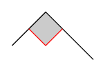
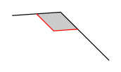

# tikz-rightangles
This is a TikZ library named **`rightangles`** that provides a way to draw right angles.

The library is a simple modification of the original library `angles`.

## How to use it
* Put `tikzlibraryrightangles.code.tex` file in a folder accessible by latex.
  For example in the same folder as your main file.
* Load the library with
```latex
\usetikzlibrary{rightangles}
```

## Basic usage examples

You can use `right angle` pics in the same way you use `angle` pics.

For example the code
```latex
\documentclass[tikz,border=7pt]{standalone}
\usetikzlibrary{rightangles}
\begin{document}
  \tikz \draw (2,0) coordinate (A) -- (1,1) coordinate (B)
    -- ([turn]90:1) coordinate (C)
    pic [draw=red,fill=lightgray,angle eccentricity=.5,pic text=$\cdot$] {right angle = C--B--A};
\end{document}
```


And you can use it also to obtain right angles in perspective
```latex
\documentclass[tikz,border=7pt]{standalone}
\usetikzlibrary{rightangles}
\begin{document}
  \tikz \draw (2,0) coordinate (A) -- (1,1) coordinate (B)
    -- ([turn]49:1) coordinate (C)
    pic [draw=red,fill=lightgray] {right angle = A--B--C};
\end{document}
```


## License

This file may be distributed and/or modified

  1. under the LaTeX Project Public License and/or
  2. under the GNU Public License.

Both licenses are available in the LICENSES folder.
